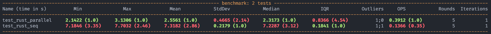

# image-augmentation
Moduł do augmentacji zdjęć w wykorzystaniem równoległego przetwarzania w Rust.

Niestety nie udało się osiągnać założeń, jednak udowodniono znaczną róźnicę w przetwarzaniu równoległym, a sekwencyjnym.




### Instalacja
```bash
python -m venv .env
source .env/bin/activate
pip install maturin pillow matplotlib numpy pytest pytest-benchmark
maturin init --bindings pyo3
maturin develop
```
### Przykładowe użycie

```bash
# source
source .env/bin/activate

# Odpalenie przykładowego skryptu, który odwraca obraz horyzontalnie
python main.py

# Odpalenie benchmarków
pytest
```
 